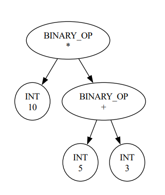

# 🔍 Projeto Fase 3 – Analisador Léxico e Sintático LL(1)

**Grupo 04**  
- Gabriel Martins Vicente 
- Javier Agustin Aranibar González 
- Matheus Paul Lopuch 
- Rafael Bonfim Zacco  

---

## 🧠 Objetivo

Desenvolver um **analisador léxico e sintático** para uma linguagem baseada em **Notação Polonesa Reversa (RPN)**, utilizando **Parser LL(1)**. O sistema também avalia as expressões via **AST (Abstract Syntax Tree)** e suporta estruturas de controle e memória.

---

## 🛠️ Como Executar

### 🔧 Requisitos
- Python 3.x  
- Bibliotecas:
  ```bash
  pip install numpy graphviz

Execução:
```bash
  python analisador.py teste1.txt
```
Substitua teste1.txt por qualquer um dos arquivos de teste.

---

## 📄 Linguagem Suportada
### 🧮 Operações Aritméticas (RPN)
Soma: (A B +)

Subtração: (A B -)

Multiplicação: (A B *)

Divisão real: (A B |)

Divisão inteira: (A B /)

Módulo: (A B %)

Potenciação: (A B ^)

### ⚙️ Operadores de Comparação
<, >, ==, !=, <=, >=

### 🧾 Comandos Especiais
(N RES) → valor da linha N anterior

(V MEM) → armazena valor V na memória

(MEM) → retorna o valor armazenado ou 0.0

### 🔁 Estruturas de Controle
Condicional:
(if COND then EXPR1 else EXPR2)

Laço:
(for INT EXPR)

## 🌳 Árvore Sintática Abstrata (AST)
Para cada linha do arquivo analisado, uma AST é construída.
Ela é exibida no terminal e salva como PDF (ast_line_X.pdf) e .txt.

- Exemplo:
  ```bash
  (10 (5 3 +) *)
  ```
  Resultado:
 ```bash
  BINARY_OP: *
  INT: 10
  BINARY_OP: +
    INT: 5
    INT: 3
```
  Arquivo PDF criado:
- 

## 🧪 Arquivos de Teste
### Arquivo	Conteúdo
- teste1.txt	Operações básicas (soma, divisão, etc.)
- teste2.txt	Uso de MEM, RES, expressões aninhadas
- teste3.txt	Estruturas if, for, memória e aninhamentos

## 🧾 Gramática LL(1)
```bash
  S -> EXPR

EXPR -> ( OPERAND OPERAND OPERATOR )
      | ( if EXPR then EXPR else EXPR )
      | ( for INT EXPR )
      | ( INT RES )
      | ( NUM MEM )
      | ( MEM )
      | NUM

OPERAND -> EXPR | NUM | MEM
OPERATOR -> + | - | * | / | % | ^ | | | < | > | == | != | <= | >=
NUM -> INT | REAL
```

## 📌 Conjuntos FIRST & FOLLOW + Tabela LL(1)
Veja o arquivo:
[📄 PDF: Analisador Sintático - Gramática LL(1)](./Analisador%20Sint%C3%A1tico%20-%20Gram%C3%A1tica%20LL(1).pdf)

## ✅ Funcionalidades Extras
- Suporte completo a IEEE754 de meia precisão com numpy.float16
- Histórico de expressões para uso com RES
- Visualização de árvore sintática em PDF
- Tratamento de erros: sintáticos, léxicos e aritméticos
